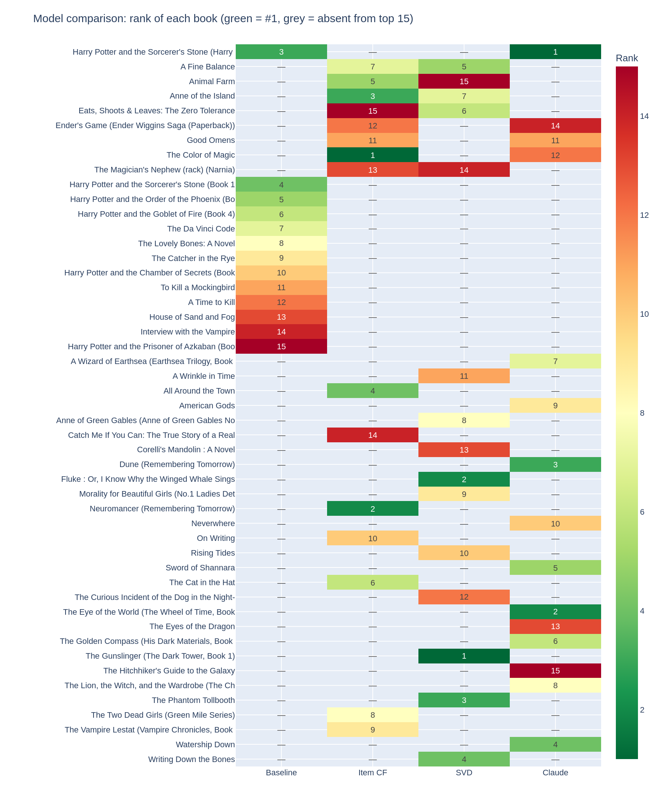

# "I liked Lord of the Rings — what should I read next?"

A book recommendation system built on the [Book-Crossing dataset](https://www.kaggle.com/datasets/syedjaferk/book-crossing-dataset) for a DataSentics case study.

---

## The problem

Given that a user enjoyed Lord of the Rings, recommend books they would like next.  
The dataset has **1.1 million ratings**, **278k users**, and **270k books** — all keyed by ISBN.

---

## What's in the notebook

[notebook.py](notebook.py) is a [Marimo](https://marimo.io) reactive notebook with two parts:

**Part 1 — EDA**
- Explicit vs implicit ratings (62% of ratings are 0 = "I read it but didn't score")
- Rating distribution and positivity bias
- Sparsity (~99.997% of the full matrix is empty)
- Long-tail distribution of book popularity
- Identifying all LOTR editions across 130+ ISBNs

**Part 2 — Models**

| # | Model | Core idea |
|---|---|---|
| 1 | Popularity baseline | Books most read by LOTR readers, ranked by count |
| 2 | Item-based CF | Cosine similarity on the transposed, mean-centred rating matrix |
| 3 | SVD | 50-dimensional latent "taste space"; LOTR's nearest neighbours |
| — | Claude's picks | 15 hand-curated books as a genre-knowledge reference column |

All four are compared in a rank heatmap; an interactive demo lets you query any book against any model.

---

## Running it

```bash
# 1. create venv and install dependencies
python -m venv .venv && source .venv/bin/activate
pip install marimo pandas numpy scipy plotly requests

# 2. download the dataset from Kaggle into data/
#    https://www.kaggle.com/datasets/syedjaferk/book-crossing-dataset
#    expected: data/Books.csv  data/Ratings.csv  data/Users.csv

# 3. run as interactive app
marimo run notebook.py

# 4. or open as editable notebook
marimo edit notebook.py
```

---

## Dataset stats

| Metric | Value |
|---|---|
| Total ratings | 1,149,780 |
| Unique users | 278,858 |
| Unique books | 271,360 |
| Implicit ratings (= 0) | 62% |
| Sparsity (explicit matrix) | 99.997% |
| After 20/20 filter | 3,151 users × 832 books |
| LOTR raters in filtered set | 184 |

---

## Results

### Model 1 — Popularity Baseline
*Books most read by LOTR readers in the filtered dataset*

| # | Title | Author | LOTR readers | Avg rating |
|---|---|---|---|---|
| 1 | Harry Potter and the Prisoner of Azkaban | J. K. Rowling | 26 | 9.1 |
| 2 | Harry Potter and the Chamber of Secrets | J. K. Rowling | 25 | 9.0 |
| 3 | Harry Potter and the Sorcerer's Stone | J. K. Rowling | 25 | 8.6 |
| 4 | Harry Potter and the Order of the Phoenix | J. K. Rowling | 24 | 9.4 |
| 5 | Harry Potter and the Goblet of Fire | J. K. Rowling | 23 | 9.5 |
| 6 | The Da Vinci Code | Dan Brown | 21 | 9.0 |
| 7 | The Lovely Bones | Alice Sebold | 18 | 7.7 |
| 8 | The Catcher in the Rye | J. D. Salinger | 16 | 8.4 |
| 9 | To Kill a Mockingbird | Harper Lee | 16 | 9.2 |
| 10 | Interview with the Vampire | Anne Rice | 14 | 6.9 |

> **Note:** Harry Potter dominates because it's genuinely the most-read series among LOTR readers in this dataset — and it's fragmented across many ISBNs (different editions). The baseline captures **popularity within the LOTR audience**, not genre similarity.

---

### Model 2 — Item-Based Collaborative Filtering
*Books whose rating patterns most resemble LOTR's across the user base*

| # | Title | Author | Cosine sim |
|---|---|---|---|
| 1 | The Color of Magic | Terry Pratchett | 0.171 |
| 2 | Neuromancer | William Gibson | 0.153 |
| 3 | Animal Farm | George Orwell | 0.080 |
| 4 | Good Omens | Neil Gaiman & Pratchett | 0.073 |
| 5 | Ender's Game | Orson Scott Card | 0.073 |
| 6 | The Magician's Nephew (Narnia) | C. S. Lewis | 0.071 |
| 7 | The Vampire Lestat | Anne Rice | 0.074 |
| 8 | Anne of the Island | L. M. Montgomery | 0.084 |
| 9 | A Fine Balance | Rohinton Mistry | 0.076 |
| 10 | On Writing | Stephen King | 0.073 |

> **Note:** Low cosine similarities (0.07–0.17) reflect how sparse the matrix still is even after filtering — few users rated both LOTR and any given other book. The model does surface Pratchett, Gaiman, Card and Lewis — genre-adjacent picks — but also pulls in noise. Sparsity is the core limitation here.

---

### Model 3 — SVD (Matrix Factorisation)
*Nearest neighbours to LOTR in a 50-dimensional latent taste space*

| # | Title | Author | SVD score |
|---|---|---|---|
| 1 | The Gunslinger (Dark Tower, Book 1) | Stephen King | 0.471 |
| 2 | The Phantom Tollbooth | Norton Juster | 0.442 |
| 3 | A Fine Balance | Rohinton Mistry | 0.420 |
| 4 | A Wrinkle in Time | Madeleine L'Engle | 0.370 |
| 5 | Animal Farm | George Orwell | 0.340 |
| 6 | The Magician's Nephew (Narnia) | C. S. Lewis | 0.343 |
| 7 | The Curious Incident of the Dog in the Night-Time | Mark Haddon | 0.367 |
| 8 | Anne of Green Gables | L. M. Montgomery | 0.374 |
| 9 | Fluke | Christopher Moore | 0.444 |
| 10 | Writing Down the Bones | Natalie Goldberg | 0.432 |

> **Note:** SVD finds latent structure across the whole matrix. Dark Tower, Narnia and Wrinkle in Time are strong genre hits. Some picks (Fluke, Writing Down the Bones) reflect latent dimensions that happen to align with LOTR's pattern of ratings but aren't genre matches — a known artefact of SVD on sparse data.

---

### Claude's Picks — genre-knowledge reference
*15 books hand-picked from within the filtered dataset; all verified to be in the 20/20 filtered set*

| # | Title | Author | Why |
|---|---|---|---|
| 1 | Harry Potter and the Sorcerer's Stone | J. K. Rowling | Most natural next series for any LOTR reader |
| 2 | The Eye of the World | Robert Jordan | Closest structural heir to LOTR |
| 3 | Dune | Frank Herbert | The LOTR of sci-fi: world-building, prophecy, chosen one |
| 4 | Watership Down | Richard Adams | Epic journey, unlikely heroes, same emotional register |
| 5 | Sword of Shannara | Terry Brooks | Literally modelled on LOTR |
| 6 | The Golden Compass | Philip Pullman | World-building on Tolkien's scale |
| 7 | A Wizard of Earthsea | Ursula K. Le Guin | Co-invented the fantasy genre alongside Tolkien |
| 8 | The Lion, the Witch, and the Wardrobe | C. S. Lewis | Tolkien and Lewis were friends; same mythological DNA |
| 9 | American Gods | Neil Gaiman | Mythology, ancient beings, literary quality |
| 10 | Neverwhere | Neil Gaiman | Hidden magical world, dark and beautiful |
| 11 | Good Omens | Gaiman & Pratchett | Two fantasy legends collaborating |
| 12 | The Color of Magic | Terry Pratchett | Greatest fantasy universe outside Middle-earth |
| 13 | The Eyes of the Dragon | Stephen King | King's only pure fantasy novel |
| 14 | Ender's Game | Orson Scott Card | Different genre, identical passionate readership |
| 15 | The Hitchhiker's Guide to the Galaxy | Douglas Adams | Essential for any genre fiction reader |

---

## Model comparison heatmap

The heatmap below shows the rank each model assigned to each book (green = rank 1, grey = not in that model's top 15). Books appearing across multiple models carry higher confidence.


